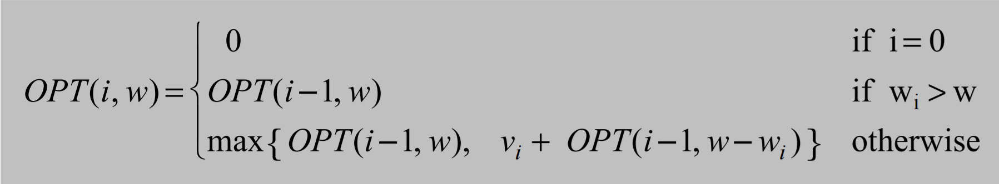
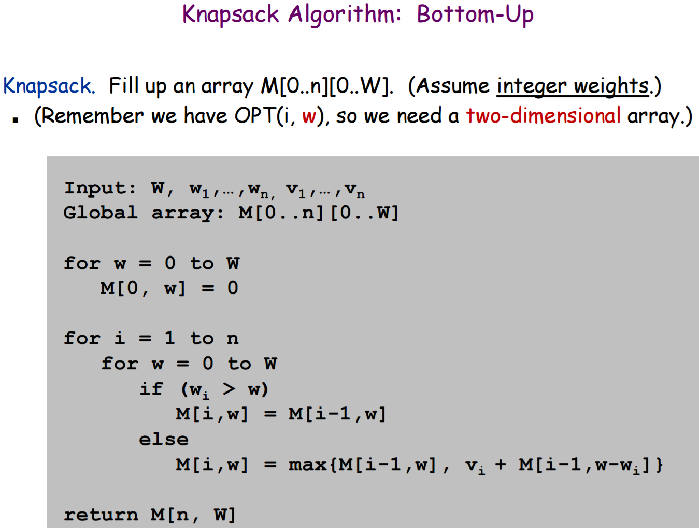
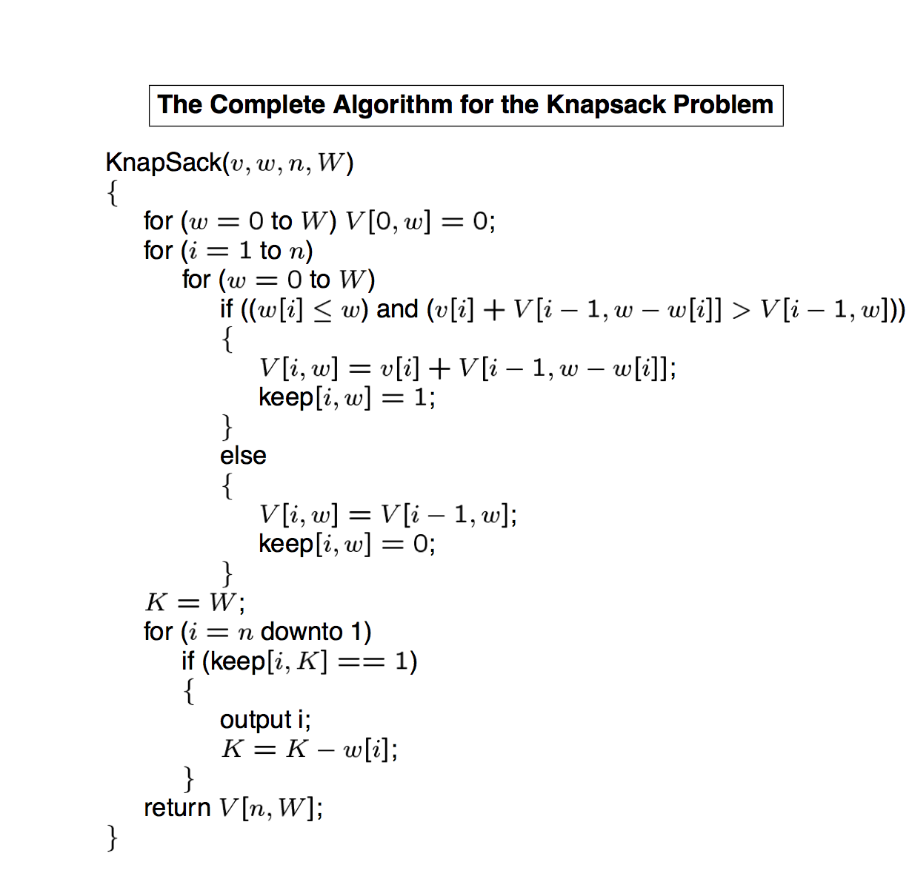
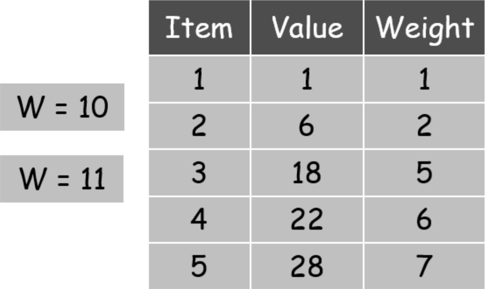

# 0-1 Knapsack Problem
Implementation of the 0-1 (binary) Knapsack Problem  
Technically an NP-Hard problem, so this solution doesn't scale for large values of the Knapsack Capacity

## Optimal Substructure
**w is the current max weight of the knapsack** (goes from 0 to W, the actual max weight of the knapsack)  
- If wi>W, the item it too heavy to fit in the knapsack, so we copy the value from row above: `OPT(i-1,w)`
- If the item CAN fit there are 2 cases
  1. The current item is not included, just copy from row above: `OPT(i-1,w)`
  2. Current item *IS* included, add it's value & find OPT for a new weight: `vi + OPT(i-1,w-wi)`

## Pseudocode

## Finding the Knapsack's Contents
A slightly different version of the algorithm, but the point is the final loop that recovers the items from the keep array

## Example Problem
  
This program runs on 5 items with 2 different weight capacities: 11 and 10

### Capacity=11 Solution

### Optimal Solution is total value=40 from item 3 & 4

## Notes
- `solveKnapsack()` populates the memoization table & finds the maximum weight possible
  - `memoizationTable` is filled with `-1` to distinguish from completed rows
  - Then 0th row is filled with `0`
  - `memoizationTable` is printed using `printTable()` after each row is completed
- `findOptimalKnapsackContents()` is called after `solveKnapsack()` to see what items were actually added
- **The ID or name of an Item is its array index**
- Must be **non-negative** integer weights
- **Run with different items by changing arrays for `values`, `weights` & `numberOfItems`  
There is no error checking between those 3 fields, so hard-code them into the constructor**  
`verifyCorrectArrayLength()` can be used to see if the array lengths match `numberOfItems`, but it's not enforced
- View output with **fixed-width font** for columns to line up (configure your IDE or copy to new document)

## Code Details
- Arrays are indexed from 1 to make human readable
- Put a 0 as the 1st element of `values` and `weights`
- `memoizationTable` and `chosenItems` are both initialized to dimensions `[numberOfItems+1][knapsackWeightCapacity+1]` to keep it indexed from 1
- Pseudocode has a step to set all values in 0th row to 0. **Not needed since Java initialized the entire 2D array to 0's**
- `findWidestNumberInTable()`, `findWidestElementInList()` and `leftPad()` are all helper methods used by `printTable()`
- `printTable()` is pretty fancy & prints padding spaces to the left of numbers so the columns line up. It looks nicer, but doesn't have to be that complicated
- `solveKnapsack()` populates memoization table & adds `true` to the corresponding cell in `chosenItems` matrix when an item is added
- **`findOptimalKnapsackContents()` works backwards from the bottom right corner of the `chosenItems` matrix**
  - A `true` in `chosenItems` means that an item was added to get that max value when calculating `memoizationTable`, `false` means it just **copied the value from the row above**
  - Start with `currentCapacity=knapsackWeightCapacity`
  - `i` goes from `numberOfItems` down to 1
  - If a value is `true`, we included that item in the knapsack so output the item @ row `i`
  - Since we included an Item, subtract its weight from `currentCapacity` ( `currentCapacity -= weights[i] -= weights[i]` )  
  This will move the `currentCapacity` left some number of columns
  - Continue until it reaches the 1st row
  - Done
